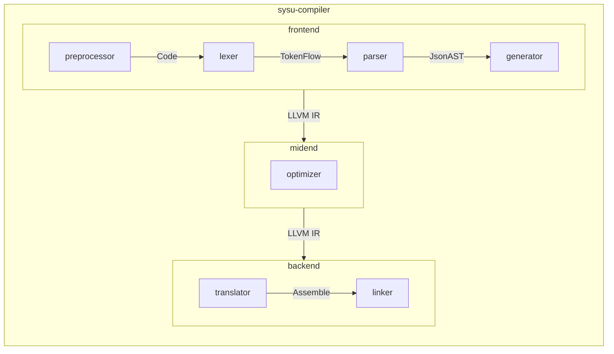

# SYsU-lang

SYsU 是一个教学语言，应用于中山大学（**S**un **Y**at-**s**en **U**niversity）[编译原理课程](https://xianweiz.github.io/teach/dcs290/s2022.html)的教学。本项目是该课程的实验模板，可以得到一个 SYsU language 的编译器组件。实验的设计目标包括：

1. 在兼容 [SysY](https://gitlab.eduxiji.net/nscscc/compiler2021/-/blob/master/SysY%E8%AF%AD%E8%A8%80%E5%AE%9A%E4%B9%89.pdf) 语言的基础上，增加最少的语法支持，使其可以编译 [Yat-sen OS](https://github.com/NelsonCheung-cn/yatsenos-riscv)。
2. 按照自顶向下的顺序进行实验，各个实验模块之间可通过管道进行通信（微 内 核）。
3. 实验模块无缝对接 Clang/LLVM，避免前一个实验失败影响后续实验开展。
4. 支持在线/本地/Github Action 自动批改。

在 2022 春季学期的教学中，学生实现的编译器的性能可达 `clang -O3` 的 48%，相较于初始版本加速比超过 400%，推荐阅读相关[论文](https://github.com/arcsysu/SYsU-lang-paper)以了解我们的理念与实验设计，也欢迎其他高校相关课程使用并反馈！我们同样开放了[实验文档](https://github.com/arcsysu/SYsU-lang/wiki)与基于 docker 的[在线评测框架](https://zhuanlan.zhihu.com/p/479027855)。

## 编译运行

需要注意的是，[SysY](https://gitlab.eduxiji.net/nscscc/compiler2021/-/blob/master/SysY%E8%AF%AD%E8%A8%80%E5%AE%9A%E4%B9%89.pdf) 语言允许编译时能够求值的 `const int` 作为数组大小，导致部分算例不能通过 `gcc` 的编译，因此为保持兼容推荐使用 `clang` 编译。经过测试的实验环境为 `debian:11`。

```bash
# 安装依赖
sudo apt-get install -y --no-install-recommends \
  clang llvm-dev zlib1g-dev lld flex bison \
  cmake python3 ninja-build git

git clone https://github.com/arcsysu/SYsU-lang
cd SYsU-lang

# 编译安装
# `${CMAKE_C_COMPILER}` 仅用于编译 `.sysu.c`
# 非 SYsU 语言的代码都将直接/间接使用 `${CMAKE_CXX_COMPILER}` 编译（后缀为 `.cc`）
rm -rf $HOME/sysu
cmake -G Ninja \
  -DCMAKE_BUILD_TYPE=RelWithDebInfo \
  -DCMAKE_C_COMPILER=clang \
  -DCMAKE_CXX_COMPILER=clang++ \
  -DCMAKE_INSTALL_PREFIX=$HOME/sysu \
  -DCMAKE_PREFIX_PATH="$(llvm-config --cmakedir)" \
  -DCPACK_SOURCE_IGNORE_FILES=".git/;tester/third_party/" \
  -B $HOME/sysu/build
cmake --build $HOME/sysu/build
cmake --build $HOME/sysu/build -t install

# 检查各实验的得分
CTEST_OUTPUT_ON_FAILURE=1 cmake --build $HOME/sysu/build -t test

# 打包源代码以提交作业
cmake --build $HOME/sysu/build -t package_source

# 检查编译结果
( export PATH=$HOME/sysu/bin:$PATH \
  CPATH=$HOME/sysu/include:$CPATH \
  LIBRARY_PATH=$HOME/sysu/lib:$LIBRARY_PATH \
  LD_LIBRARY_PATH=$HOME/sysu/lib:$LD_LIBRARY_PATH &&
  sysu-compiler -S -o a.S tester/functional/000_main.sysu.c &&
  clang -O0 -lsysy -lsysu -o a.out a.S &&
  ./a.out ;
  echo $? &&
  rm -f a.S a.out )

# 编译器自举（预留接口，当前直接调用 clang）
rm -rf $HOME/sysu-stage2
cmake -G Ninja \
  -DCMAKE_C_COMPILER=$HOME/sysu/bin/sysu-compiler \
  -DCMAKE_CXX_COMPILER=clang++ \
  -DCMAKE_INSTALL_PREFIX=$HOME/sysu-stage2 \
  -DCPACK_SOURCE_IGNORE_FILES=".git/;tester/third_party/" \
  -DSYSU_TESTER=1 \
  -B $HOME/sysu-stage2/build
cmake --build $HOME/sysu-stage2/build
cmake --build $HOME/sysu-stage2/build -t install
```

对于使用其他操作系统的同学，我们准备了一份 [docker 开发环境](https://hub.docker.com/r/wukan0621/sysu-lang)。

```bash
docker pull wukan0621/sysu-lang
docker run \
  --name sysu-lang \
  -v "$PWD/workspace:/workspace" \
  -it wukan0621/sysu-lang \
  bash
# 随后可以在宿主机当前目录的 workspace/SYsU-lang 目录下开发
```

## 语法特征

SYsU 是 C 语言的子集，同时也是 [SysY](https://gitlab.eduxiji.net/nscscc/compiler2021/-/blob/master/SysY%E8%AF%AD%E8%A8%80%E5%AE%9A%E4%B9%89.pdf) 语言的超集，在后者的基础上进行了一些调整，以适应课程需要：

1. 源代码后缀名由 `.sy` 调整为 `.sysu.c`。
2. 元素类型增加 `char`、`long long`。
3. 常量类型增加字符串常量。多行字符串只支持多个`""`的拼接，不支持斜杠 `\` 语法。
4. 不支持字符常量，而应当用字符串常量与下标寻址表示（如`"c"[0]`）。
5. 语句类型增加 `do` - `while` 循环。
6. 源代码通过**预处理器**（如 `clang -E`）处理后传给**编译器**。
7. 预处理语句以 `#` 开头，并且总是占据一整行。
8. 运行时库提供的函数需要预先 `#include`。
9. 不要求每个文件都包含 `main` 函数，可以分模块编译并链接。
10. Do what you want to do

## 运行架构

本项目的运行架构如下图。



### `compiler`

SYsU 编译器的上层驱动，类似于 `clang`。当前支持的额外功能包括：

- `-h`：查看完整使用帮助
- `--unittest`：单元测试
- `--convert-sysy`：转换 SysY 到 SYsU

```bash
( export PATH=$HOME/sysu/bin:$PATH \
  CPATH=$HOME/sysu/include:$CPATH \
  LIBRARY_PATH=$HOME/sysu/lib:$LIBRARY_PATH \
  LD_LIBRARY_PATH=$HOME/sysu/lib:$LD_LIBRARY_PATH &&
  sysu-compiler tester/functional/000_main.sysu.c )
```

后续功能开发中，详见 `-h`；未支持的参数将尝试传递给 `clang` 执行。

### `preprocessor`

SYsU 的预处理器。当前 `sysu-preprocessor` 直接调用 `clang --driver-mode=cpp`，学有余力的同学也可自行实现。

```bash
$ ( export PATH=$HOME/sysu/bin:$PATH \
  CPATH=$HOME/sysu/include:$CPATH \
  LIBRARY_PATH=$HOME/sysu/lib:$LIBRARY_PATH \
  LD_LIBRARY_PATH=$HOME/sysu/lib:$LD_LIBRARY_PATH &&
  sysu-preprocessor tester/functional/000_main.sysu.c )
# 1 "tester/functional/000_main.sysu.c"
# 1 "<built-in>" 1
# 1 "<built-in>" 3
# 341 "<built-in>" 3
# 1 "<command line>" 1
# 1 "<built-in>" 2
# 1 "tester/functional/000_main.sysu.c" 2
int main(){
    return 3;
}
```

### `lexer`

SYsU 的词法分析器，产生类似于 `clang -cc1 -dump-tokens 2>&1` 的输出。作为词法分析实验模块，本仓库中的 `sysu-lexer` 并不能处理完整的 SYsU，但提供了一个模板，需要学生将其词法规则补充完整（[详细实验要求](lexer/README.md)）。

```bash
$ ( export PATH=$HOME/sysu/bin:$PATH \
  CPATH=$HOME/sysu/include:$CPATH \
  LIBRARY_PATH=$HOME/sysu/lib:$LIBRARY_PATH \
  LD_LIBRARY_PATH=$HOME/sysu/lib:$LD_LIBRARY_PATH &&
  sysu-preprocessor tester/functional/000_main.sysu.c |
  sysu-lexer )
int 'int'               Loc=<tester/functional/000_main.sysu.c:1:1>
identifier 'main'               Loc=<tester/functional/000_main.sysu.c:1:5>
l_paren '('             Loc=<tester/functional/000_main.sysu.c:1:9>
r_paren ')'             Loc=<tester/functional/000_main.sysu.c:1:10>
l_brace '{'             Loc=<tester/functional/000_main.sysu.c:1:11>
return 'return'         Loc=<tester/functional/000_main.sysu.c:2:5>
numeric_constant '3'            Loc=<tester/functional/000_main.sysu.c:2:12>
semi ';'                Loc=<tester/functional/000_main.sysu.c:2:13>
r_brace '}'             Loc=<tester/functional/000_main.sysu.c:3:1>
eof ''          Loc=<tester/functional/000_main.sysu.c:3:2>
```

### `parser`

SYsU 的语法分析器，接受来自 `sysu-lexer` 的输入，输出一个 json 格式的语法分析树（类似于 `clang -cc1 -ast-dump=json`）。作为语法分析实验模块，本仓库中的 `sysu-parser` 并不能处理完整的 SYsU，但提供了一个模板，需要学生将其语法规则补充完整（[详细实验要求](parser/README.md)）。

<!--  -->

```bash
$ ( export PATH=$HOME/sysu/bin:$PATH \
  CPATH=$HOME/sysu/include:$CPATH \
  LIBRARY_PATH=$HOME/sysu/lib:$LIBRARY_PATH \
  LD_LIBRARY_PATH=$HOME/sysu/lib:$LD_LIBRARY_PATH &&
  sysu-preprocessor tester/functional/000_main.sysu.c |
  sysu-lexer |
  sysu-parser )
{"inner":[{"inner":[{"inner":[{"inner":[{"kind":"IntegerLiteral","value":"3"}],"kind":"ReturnStmt"}],"kind":"CompoundStmt"}],"kind":"FunctionDecl","name":"main"}],"kind":"TranslationUnitDecl"}
```

<!--  -->

当然，也可以直接从 `clang -cc1 -dump-tokens 2>&1` 获得输入。

```bash
( export PATH=$HOME/sysu/bin:$PATH \
  CPATH=$HOME/sysu/include:$CPATH \
  LIBRARY_PATH=$HOME/sysu/lib:$LIBRARY_PATH \
  LD_LIBRARY_PATH=$HOME/sysu/lib:$LD_LIBRARY_PATH &&
  clang -E tester/functional/000_main.sysu.c |
  clang -cc1 -dump-tokens 2>&1 |
  sysu-parser )
```

### `generator`

`sysu-generator` 将 `sysu-parser` 得到的语法分析树转换为 LLVM IR。作为代码生成实验模块，本仓库中的 `sysu-generator` 并不能处理完整的 SYsU，但提供了一个模板，需要学生将其补充完整（[详细实验要求](generator/README.md)）。

```bash
$ ( export PATH=$HOME/sysu/bin:$PATH \
  CPATH=$HOME/sysu/include:$CPATH \
  LIBRARY_PATH=$HOME/sysu/lib:$LIBRARY_PATH \
  LD_LIBRARY_PATH=$HOME/sysu/lib:$LD_LIBRARY_PATH &&
  sysu-preprocessor tester/functional/000_main.sysu.c |
  sysu-lexer |
  sysu-parser |
  sysu-generator )
; ModuleID = '-'
source_filename = "-"

define i32 @main() {
entry:
  ret i32 3
}
```

### `optimizer`

`sysu-optimizer` 是 SYsU 的优化器，从 `sysu-generator` 获得输入，输出优化后的 LLVM IR。作为代码优化实验模块，本仓库中的 `sysu-optimizer` 并没有实现优化 IR 的功能，需要学生将其补充完整（[详细实验要求](optimizer/README.md)）。

注意在以下的输出中，`; ModuleID = '<stdin>'` 前的输出来自 `stderr`，包含了一个来自 [banach-space/llvm-tutor](https://github.com/banach-space/llvm-tutor/blob/main/lib/StaticCallCounter.cpp) 的 `StaticCallCounter` Pass，可以统计生成代码中包含哪些 `call` 调用。

```bash
$ ( export PATH=$HOME/sysu/bin:$PATH \
  CPATH=$HOME/sysu/include:$CPATH \
  LIBRARY_PATH=$HOME/sysu/lib:$LIBRARY_PATH \
  LD_LIBRARY_PATH=$HOME/sysu/lib:$LD_LIBRARY_PATH &&
  sysu-preprocessor tester/functional/000_main.sysu.c |
  sysu-lexer |
  sysu-parser |
  sysu-generator |
  sysu-optimizer )
=================================================
sysu-optimizer: static analysis results
=================================================
NAME                 #N DIRECT CALLS
-------------------------------------------------
-------------------------------------------------

; ModuleID = '<stdin>'
source_filename = "-"

define i32 @main() {
entry:
  ret i32 3
}
```

同时提供了一个 LLVM 插件 `libsysuOptimizer.so`，可以使用 `opt` 直接加载。这意味着 `sysu-optimizer` 中的 pass 也可直接用于 LLVM 生态。

```bash
( export PATH=$HOME/sysu/bin:$PATH \
  CPATH=$HOME/sysu/include:$CPATH \
  LIBRARY_PATH=$HOME/sysu/lib:$LIBRARY_PATH \
  LD_LIBRARY_PATH=$HOME/sysu/lib:$LD_LIBRARY_PATH &&
  clang -E tester/mizuno_ai/mizuno_ai.sysu.c |
  clang -cc1 -S -emit-llvm |
  opt --enable-new-pm -S -load-pass-plugin=libsysuOptimizer.so -passes="sysu-optimizer-pass" )
```

### `translator`

将 LLVM IR 翻译成汇编或二进制文件。当前 `sysu-translator` 直接调用 `llc`，学有余力的同学也可自行实现。

### `linker`

链接器。当前 `sysu-linker` 直接调用 `ld.lld`，学有余力的同学也可自行实现。

### `librarian`

#### SysY 运行时库

为了可移植性以及与 C 标准库的兼容性，此处自行实现了 `libsysy`，与 [nscscc/compiler2021](https://gitlab.eduxiji.net/nscscc/compiler2021/) 中提供的 [`sylib.h`](https://gitlab.eduxiji.net/nscscc/compiler2021/-/blob/master/%E5%85%AC%E5%BC%80%E7%94%A8%E4%BE%8B%E4%B8%8E%E8%BF%90%E8%A1%8C%E6%97%B6%E5%BA%93/sylib.h) 保持 API 兼容性，但不保证 ABI 兼容性。换言之，原有的 [SysY](https://gitlab.eduxiji.net/nscscc/compiler2021/-/blob/master/SysY%E8%AF%AD%E8%A8%80%E5%AE%9A%E4%B9%89.pdf) 代码需要转换为 SYsU 并重新编译。

#### SYsU 运行时库

`libsysu` 暴露了类似于 `open()`、`read()`、`write()`、`close()`、`fork()` 的系统调用，使 SYsU 具有了处理文件、使用多进程的可能。

后续会逐步支持更多 C 标准库函数与 Linux 系统函数，以用于 [Yat-sen OS](https://github.com/NelsonCheung-cn/yatsenos-riscv) 或实现编译器自举。

### `tester`

目录下提供了一系列 SYsU 格式的测试代码以及对应程序的输入输出，修改自 [nscscc/compiler2021](https://gitlab.eduxiji.net/nscscc/compiler2021/) 中提供的算例。

大算例以 `git submodule` 的形式存放在 `tester/third_party`。加载方式：

```bash
git submodule update --init
```

## 实验反馈

- 交流实验中遇到的困难：[](https://github.com/arcsysu/SYsU-lang/discussions)
- 提出实验设计的问题：[](https://github.com/arcsysu/SYsU-lang/issues)
- 改善这个实验：[](https://github.com/arcsysu/SYsU-lang/pulls)

### Q & A：为什么要基于 LLVM，而不是真正的从零开始实现一个框架？

1. 即使我们重新实现一个实验框架，也并没有让学生“从零开始写编译器”，学生仍然要去熟悉助教提供的实验框架。
2. LLVM 是久经考验的编译器框架，我们希望学生可以熟悉 LLVM，培养出业界真正需要的人才。
3. 本项目中每个实验提供的模板都只有一百行左右，可以降低学生上手的门槛；当学生完成整个项目后，也会具备从零开始实现一个编译器的能力，从课堂教学的角度已经足够。

### Q & A：为什么是编译到 LLVM IR，而不是某种汇编，如 RV32I？

1. 一个观点是，在编译原理课程上，不应该过多涉及硬件架构的细节。
2. LLVM IR 已经相对底层，非常好翻译成各种汇编，实际上也可以用与本项目相同的方式写一个编译器。
3. 我们也预留了 LLVM IR 到汇编的接口 `sysu-translator` 以及链接器的接口 `sysu-linker`，相关部分的可选实验设计正在进行中，学有余力的同学也可以自行实现。

### Q & A：为什么将词法分析器等模块实现为单独的可执行文件，可能导致运行低效率？

1. 面向教学用的编译器，并不会用于生产环境，低效是可以接受的。实际上学生也可以调整代码，将各个模块链接成一个可执行文件。
2. 自顶向下的开展实验，可以和老师的教学进度同步。各个模块可以直接由 `clang` 代替 ，避免学生一个实验不成功影响到后续实验的开展。
3. 如果按照其他高校类似实验中的方案（不断在已有的实现上增加语法），虽然更符合现实中一门语言以及编译器的发展情况，但是学生在学习的开始并不具备对编译原理体系的理解，很难快速掌握自顶向下的完整技术栈。

### Q & A：为什么要对 [SysY](https://gitlab.eduxiji.net/nscscc/compiler2021/-/blob/master/SysY%E8%AF%AD%E8%A8%80%E5%AE%9A%E4%B9%89.pdf) 语法进行调整？

1. 不直接使用 [SysY](https://gitlab.eduxiji.net/nscscc/compiler2021/-/blob/master/SysY%E8%AF%AD%E8%A8%80%E5%AE%9A%E4%B9%89.pdf) 语法，避免学生直接抄袭比赛的实现。
2. 后缀名变成 `.sysu.c`，指明了 SYsU 是 C 的严格子集，可以让 `clang` 直接编译代码，方便学生与正确实现对拍。
3. 加入 `#include` 等预处理语句的支持，可以让学生更加熟悉预编译过程（即使不用实现一个预编译器），也为 SYsU 增加了实现库或调用外部库的可能（可用于实现 [Yat-sen OS](https://github.com/NelsonCheung-cn/yatsenos-riscv)）。
4. 增加 `do` - `while` 循环，因为这是很好用的[语法糖](https://mp.weixin.qq.com/s/Wwu-prowKKNDsNlzC2k9Ow)。
5. 增加 `char`、`long long` 和字符串，同样便于实现 OS。
6. 不支持字符常量，因为对其的支持和字符串常量是完全类似的，但在词法分析的时候可能会与词法分析器的输出格式产生微妙的冲突。

### Q & A: 本项目的版本管理的规则是？为什么项目名为 SYsU-lang，而非 SYsU-compiler ？

目前本项目存在两个分支：

- [`latest`](https://github.com/arcsysu/SYsU-lang/tree/latest) 分支下为中大课程教学中使用的代码，功能稳定，预期在 `debian:11` 环境中工作。
- [`unstable-slim`](https://github.com/arcsysu/SYsU-lang/tree/unstable-slim) 分支下为助教探索后续实验改革方案（如 mlir）的代码，预期在`debian:unstable-slim` 环境中工作。该分支中的文档可能不会及时更新，以对应 [Dockerfile](https://github.com/arcsysu/SYsU-lang/blob/unstable-slim/Dockerfile) 中的测试语句为准。

对于中大以外的高校教学者与个人自学者，我们建议使用 [releases](https://github.com/arcsysu/SYsU-lang/releases) 中最新发布的实验框架源码以及对应版本号的 [docker image](https://hub.docker.com/r/wukan0621/sysu-lang)。它们可能在时间上略有落后，但经过了中大一学期的教学检验，不存在潜在的可能导致教学事故的错误。我们也十分欢迎来自你们的课堂反馈[](https://github.com/arcsysu/SYsU-lang/discussions) 与改进建议[](https://github.com/arcsysu/SYsU-lang/issues)（[](https://github.com/arcsysu/SYsU-lang/pulls) 请提交至 `unstable-slim` 分支）。

版本号的命名格式为 `<major>.<minor>.<patch>.<tweak>`，如 `11.0.7.20221118`。一般来说，对于使用 `latest` 分支代码的用户，`<major>`、`<minor>`、`<patch>` 发生变化时，我们建议尽快更新至最新版本。

- `<major>` 指示了该版本的软件依赖为对应的 debian 版本
- `<minor>` 指示了该版本的功能版本，不同 `<minor>` 间可能不直接兼容
- `<patch>` 指示了该版本的补丁版本，不同 `<patch>` 间预期可以直接更新，修正前一个版本中存在的问题
- `<tweak>` 指示了当前版本代码（不含文档）的日期，可能存在微调，但不同 `<tweak>` 的代码应当具有完全相同的表现

由于本项目并没有提供一个完整的 `sysu-compiler`，而只提供了相关的开发环境，因此项目名为 SYsU-lang。[完整实现](https://github.com/SYSU-SCC/sysu-compiler)的开发已在进行，暂不对外开放。

## 你可能会感兴趣的

- [SYsU-lang 实验一、二总结+常见问题指导（不定期更新）](https://wu-kan.cn/2022/05/12/SYsU-lang-%E5%AE%9E%E9%AA%8C%E4%B8%80-%E4%BA%8C%E6%80%BB%E7%BB%93+%E5%B8%B8%E8%A7%81%E9%97%AE%E9%A2%98%E6%8C%87%E5%AF%BC-%E4%B8%8D%E5%AE%9A%E6%9C%9F%E6%9B%B4%E6%96%B0/)
- [全国大学生计算机系统能力大赛——编译系统设计赛](https://compiler.educg.net)
  - 可找到各参赛学校的开源代码
- 其它基于 [SysY](https://gitlab.eduxiji.net/nscscc/compiler2021/-/blob/master/SysY%E8%AF%AD%E8%A8%80%E5%AE%9A%E4%B9%89.pdf) 或类似语法设计的编译器实验
  - [buaa-se-compiling/miniSysY-tutorial](https://github.com/buaa-se-compiling/miniSysY-tutorial)
  - [Komorebi660/SysYF-Compiler](https://github.com/Komorebi660/SysYF-Compiler)
  - [pku-minic/online-doc](https://github.com/pku-minic/online-doc)
  - [tinsir888/Compiler-SysY](https://github.com/tinsir888/Compiler-SysY)
  - [yan-lang/ycc](https://github.com/yan-lang/ycc)
