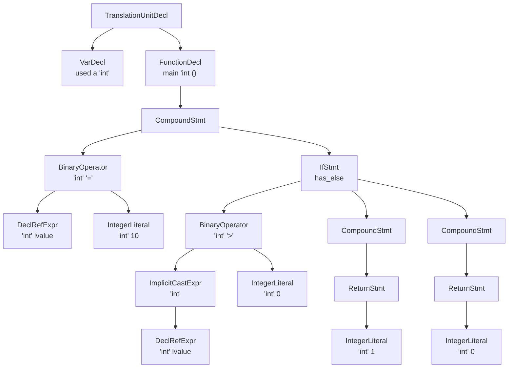

# sysu-parser

## 实验描述

在本次语法分析实验中，你被希望完成一个语法分析器，接受来自 `sysu-lexer` 的输入，产生与 `clang -cc1 -ast-dump=json` 相当的输出。预期的代码行数为 1000 行，预期的完成时间为 24 小时 ～ 72 小时。

注意，以下 log 省略了无关内容。

```bash
$ ( export PATH=$HOME/sysu/bin:$PATH \
  CPATH=$HOME/sysu/include:$CPATH \
  LIBRARY_PATH=$HOME/sysu/lib:$LIBRARY_PATH \
  LD_LIBRARY_PATH=$HOME/sysu/lib:$LD_LIBRARY_PATH &&
  clang -E tester/functional/000_main.sysu.c |
  clang -cc1 -ast-dump=json )
{
  "id": "0x1c9b558",
  "kind": "TranslationUnitDecl",
  "loc": {},
  "range": {
    "begin": {},
    "end": {}
  },
  "inner": [
    { "commet": "原先第十行到第一百五十三行为内置类型，此处省略" },
    {
      "id": "0x1cdad18",
      "kind": "FunctionDecl",
      "loc": {
        "offset": 135,
        "file": "<stdin>",
        "line": 8,
        "presumedLine": 1,
        "col": 5,
        "tokLen": 4
      },
      "range": {
        "begin": {
          "offset": 131,
          "col": 1,
          "tokLen": 3
        },
        "end": {
          "offset": 157,
          "line": 10,
          "presumedLine": 3,
          "col": 1,
          "tokLen": 1
        }
      },
      "name": "main",
      "mangledName": "main",
      "type": {
        "qualType": "int ()"
      },
      "inner": [
        {
          "id": "0x1cdae30",
          "kind": "CompoundStmt",
          "range": {
            "begin": {
              "offset": 141,
              "line": 8,
              "presumedLine": 1,
              "col": 11,
              "tokLen": 1
            },
            "end": {
              "offset": 157,
              "line": 10,
              "presumedLine": 3,
              "col": 1,
              "tokLen": 1
            }
          },
          "inner": [
            {
              "id": "0x1cdae20",
              "kind": "ReturnStmt",
              "range": {
                "begin": {
                  "offset": 147,
                  "line": 9,
                  "presumedLine": 2,
                  "col": 5,
                  "tokLen": 6
                },
                "end": {
                  "offset": 154,
                  "col": 12,
                  "tokLen": 1
                }
              },
              "inner": [
                {
                  "id": "0x1cdae00",
                  "kind": "IntegerLiteral",
                  "range": {
                    "begin": {
                      "offset": 154,
                      "col": 12,
                      "tokLen": 1
                    },
                    "end": {
                      "offset": 154,
                      "col": 12,
                      "tokLen": 1
                    }
                  },
                  "type": {
                    "qualType": "int"
                  },
                  "valueCategory": "rvalue",
                  "value": "3"
                }
              ]
            }
          ]
        }
      ]
    }
  ]
}
```

可以发现，`clang -cc1 -ast-dump=json` 输出一个 json 格式的语法分析树。我们要求你的输出不包含图上忽略的内置类型，也不需要为每个节点生成单独的 `id`。

本目录下提供了一个基于 bison + `llvm::json` 实现的模板，接受词法分析器的输出，你可以基于此继续实现完整的逻辑，也可以使用其他的工具实现，如 `antlr4`，但不得使用其提供的 [C 语言模板](https://github.com/antlr/grammars-v4/blob/master/c/C.g4)；也不得使用任何封装好的库直接获得 ast，如 `libclang`。

### Q & A：实验要求太抽象了，需要一个更直观的例子

考虑到 json 格式不方便肉眼调试，你可以像这样，输出更加符合人眼阅读方式的语法树，辅助调试。

```bash
$ ( export PATH=$HOME/sysu/bin:$PATH \
  CPATH=$HOME/sysu/include:$CPATH \
  LIBRARY_PATH=$HOME/sysu/lib:$LIBRARY_PATH \
  LD_LIBRARY_PATH=$HOME/sysu/lib:$LD_LIBRARY_PATH &&
  clang -E tester/functional/027_if2.sysu.c |
  clang -cc1 -ast-dump )
TranslationUnitDecl 0x23d4568 <<invalid sloc>> <invalid sloc>
|-TypedefDecl # 原先第二行到第十五行为内置类型，此处省略
|-VarDecl 0x2413d00 <tester/functional/027_if2.sysu.c:1:1, col:5> col:5 used a 'int'
`-FunctionDecl 0x2413e08 <line:2:1, line:10:1> line:2:5 main 'int ()'
  `-CompoundStmt 0x2414038 <col:11, line:10:1>
    |-BinaryOperator 0x2413ee8 <line:3:2, col:6> 'int' '='
    | |-DeclRefExpr 0x2413ea8 <col:2> 'int' lvalue Var 0x2413d00 'a' 'int'
    | `-IntegerLiteral 0x2413ec8 <col:6> 'int' 10
    `-IfStmt 0x2414010 <line:4:2, line:9:2> has_else
      |-BinaryOperator 0x2413f60 <line:4:6, col:8> 'int' '>'
      | |-ImplicitCastExpr 0x2413f48 <col:6> 'int' <LValueToRValue>
      | | `-DeclRefExpr 0x2413f08 <col:6> 'int' lvalue Var 0x2413d00 'a' 'int'
      | `-IntegerLiteral 0x2413f28 <col:8> 'int' 0
      |-CompoundStmt 0x2413fb0 <col:11, line:6:2>
      | `-ReturnStmt 0x2413fa0 <line:5:3, col:10>
      |   `-IntegerLiteral 0x2413f80 <col:10> 'int' 1
      `-CompoundStmt 0x2413ff8 <line:7:6, line:9:2>
        `-ReturnStmt 0x2413fe8 <line:8:3, col:10>
          `-IntegerLiteral 0x2413fc8 <col:10> 'int' 0
```

将上图对应的树画出来，可得到下图（源码参见[这里](../tester/functional/027_if2.sysu.c)）。



容易看出，lexer 实验输出的 token 构成了这棵树的叶节点。我们要做的就是，根据叶节点，写出语法规则，逐步自底向上地构造出根节点 `TranslationUnitDecl` 所在的完整子树。

另外，实验中生成的 json 格式文件，也可以在[这里](https://json2yaml.com/)转换成更易读的 yaml 格式。

### Q & A：为什么要输出到 `llvm::json`？

1. 输出到 json，便于使用 python 脚本和 clang 导出的语法树对比，自动批改。
2. 输出到 json，因为 json 格式非常容易理解，不需要像 [LLVM 官方教程](https://releases.llvm.org/11.0.1/docs/tutorial/MyFirstLanguageFrontend/LangImpl02.html) 一样定义很多节点。
3. 输出到 `llvm::json`，可以让同学们提前上手 LLVM 库的使用，平滑下一个实验的难度。

## 评分规则

本实验的评分分为两部分：基础部分和挑战部分。

- 对于基础部分的实验，由低到高分别给出三档实验要求，并要求通过对应的自动评测。详见自动评测细则一节。
- 对于挑战部分的实验，你可以完成挑战方向一节的要求，也可以自行探索；如果可能，请同时编写对应的自动评测脚本。助教将按照你实现的难度给出评分。

如有疑问，参照 `clang -cc1 -ast-dump=json`。你需要提交一份实验报告，简要记录你的实验过程、遇到的难点以及解决的方法，并在报告中附上自动评测的结果。

### 自动评测细则

本次实验的评测项目为 `parser-[0-3]`。`parser-0` 仅用于证明模板（代码与评测脚本）可以正确工作，不计入成绩；其他三个评测项依次检查：

1. `sysu-parser` 是否提取出正确的 `"kind"`、`"name"`、`"value"` 键值，不含 `"InitListExpr"`（60 分）。
2. `sysu-parser` 是否提取出正确的 `"type"` 键值及是否构造正确的 `"InitListExpr"` 生成树（30 分）。
3. `sysu-parser` 是否提取出其它非 `"id"` 以外的键值（10 分）。

评测脚本忽略空白符，可以查看[评测脚本](../compiler/sysu-compiler)以了解检查算法，但不得修改评测逻辑而投机取巧。你也可以像这样调用评测脚本，单独执行其中某一个评测项。

```bash
( export PATH=$HOME/sysu/bin:$PATH \
  CPATH=$HOME/sysu/include:$CPATH \
  LIBRARY_PATH=$HOME/sysu/lib:$LIBRARY_PATH \
  LD_LIBRARY_PATH=$HOME/sysu/lib:$LD_LIBRARY_PATH &&
  sysu-compiler --unittest=parser-1 "**/*.sysu.c" )
```

此外，[107_long_code2.sysu.c](../tester/h_functional/107_long_code2.sysu.c) 这个算例在测试时直接使用 `clang` 导出的语法树大小为 8.9G，助教这里直接给出了[压缩后的语法树](../tester/h_functional/107_long_code2.json.gz)。由于该算例语法树层级过多，评测时允许超时跳过。但你被鼓励去解决这一问题。

**根据同学们的反馈下调了实验难度，只需通过 `parser-1` 即可通过本次实验，`parser-2`、`parser-3` 列为本次实验的挑战选项。**

## 挑战方向

本节给出一些挑战方向供参考。

1. 扩展更多 C 语言的语法。
2. 不借助 bison，并完全使用 SYsU 完成本实验，然后用它作为输入测试功能是否正确，以实现自举。
3. 借助 libclang 实现相同的功能。
4. 基于语法分析树实现一些语义分析，实现一个 `sysu-tidy`，如
   - 检查是否有 `const int` 作为数组大小（符合 SysY 语法和 CPP 语法但不符合 C 语法！）
   - 检查是否有全局函数先使用后定义（符合 C 语法但不符合 CPP 语法！）
   - 检查其他 SysY 语言的语义约束
   - 检查是否有悬垂 else（`-Wdangling-else`）
   - 检查是否有未使用的值（`-Wunused-value`）
   - 检查是否有空执行体（`-Wempty-body`）
   - 检查是否有 self-comparison 等（`-Wtautological-compare`）
   - Do what you want to do
5. 基于语法分析树实现一些小工具，如
   - `sysu-format`：面向 SYsU 的代码格式化工具
   - `sysu-refactor`：面向 SYsU 的代码重构工具
     - 将输入代码的 `while (Cond) Simt` 替换为 `if (Cond) do Simt while (Cond)`
     - 或者相反！
6. 将 `sysu-lexer` 与 `sysu-parser` 的核心代码链接到一起，作为 `sysu-lang` 完整编译器的一部分。
   - 输入一个经过预处理的 SYsU 源程序，输出其语法分析树。
   - 建议：将 `sysu-lexer` 的核心代码打包成一个 `libsysuLexer.so`，将 `sysu-parser` 的核心代码打包成一个 `libsysuParser.so`，然后链接到到同一个 `main.cc`。
   - 注意：`add_flex_bison_dependency`
7. 鉴于本次实验已经开始进入 LLVM 开发范畴，建议遵守 [LLVM Coding Standards](https://releases.llvm.org/11.0.1/docs/CodingStandards.html)
   - 可以使用 `clang-tidy` 与 `clang-format` 工具检查你的代码是否规范，如 `cmake -DCMAKE_CXX_CLANG_TIDY=clang-tidy #...`
   - 将 [LLVM Coding Standards](https://releases.llvm.org/11.0.1/docs/CodingStandards.html) 与 [GNU](https://www.gnu.org/prep/standards/standards.html)、[Google](https://google.github.io/styleguide/)、[Chromium](https://chromium.googlesource.com/chromium/src/+/HEAD/styleguide/c++/c++-dos-and-donts.md)、[Microsoft](https://docs.microsoft.com/zh-cn/dotnet/csharp/fundamentals/coding-style/coding-conventions)、[Mozilla](https://firefox-source-docs.mozilla.org/code-quality/coding-style/coding_style_cpp.html)、[WebKit](https://webkit.org/code-style-guidelines/) 等其他知名编程规范进行比较，选出一种或是基于他们归纳出一个你认为最合理的编程规范，编写对应的 `.clang-format` 与 `.clang-tidy` 文件，并在以后坚持使用下去！~~（就助教来说更加偏好 LLVM，毕竟没有人会比编译器更懂语言）~~
8. 改进这个实验模板（欢迎 PR！）。
9. Do what you want to do。

## 你可能会感兴趣的

- [GNU Bison - The Yacc-compatible Parser Generator](https://www.gnu.org/software/bison/manual/)
- [FindBISON — CMake 3.18.6 Documentation](https://cmake.org/cmake/help/v3.18/module/FindBISON.html)
- [llvm::json](https://github.com/llvm/llvm-project/blob/llvmorg-11.0.1/llvm/include/llvm/Support/JSON.h)
  - 该文件同样位于 debian:11 中 [llvm-dev](https://packages.debian.org/bullseye/devel/llvm-dev) 包的 </usr/include/llvm/Support/JSON.h>。
